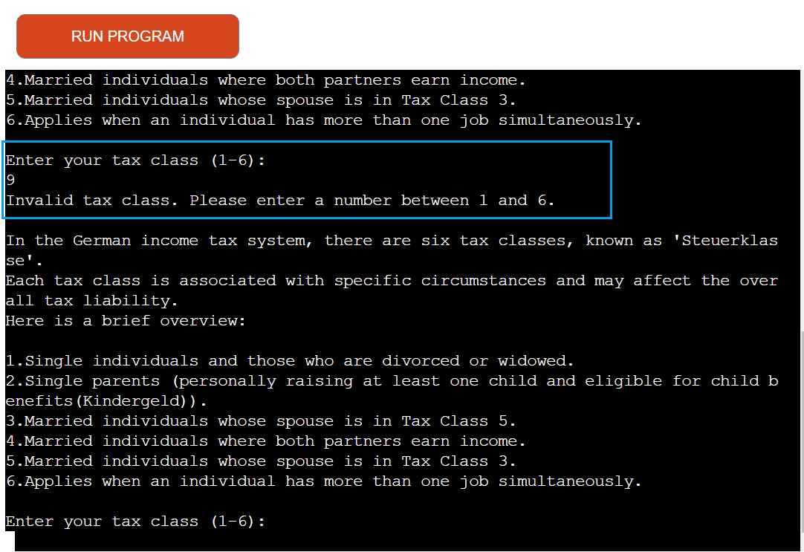

Wunder eTax is a tax refund calculator app serves as a convenient and secure solution for individuals seeking a hassle-free way to estimate their tax refunds without the burden of intricate tax language. The combination of user-friendly design, straightforward questions, and robust security measures ensures that users can confidently and easily navigate the tax estimation process.

[View live website here](https://tax-refund-calculator-6ba07d15fa62.herokuapp.com/)

# Table of Content

* [**Project**](<#project>)
    * [Project Idea](<#project-idea>)
    * [Site Users Goal](<#site-users-goal>)
    * [Site Owners Goal](<#site-owners-goal>)

* [**User Experience (UX)**](<#user-experience-ux>)
    * [Site Structure](<#site-structure>)
    * [Flow chart](<#flow-chart>)
    * [Data Model](<#data-model>)
    * [Design Choices](<#design-choices>)

* [**Features**](<#features>)

* [**Features Left To Implement**](<#features-left-to-implement>)

* [**Technologies Used**](<#technologies-used>)
    * [Languages](<#languages>)
    * [Frameworks, Librarys & Software](<#frameworks-libraries--software>)
    * [Python Packages](<#python-packages>)

* [**Testing**](<#testing>)
  * [Code Validation](<#code-validation>)
  * [Additional Testing](<#additional-testing>)
  * [Known Bugs](<#known-bugs>)
* [Deployment](<#deployment>)
* [Credits](<#credits>)
* [Acknowledgements](<#acknowledgements>)

# **Project**

## Project Idea
In Germany, the income tax refund system is primarily based on the annual income tax return.The purpose of filing an income tax return is to determine the amount of tax owed to the government or, in some cases, to claim a refund if the taxpayer has overpaid taxes.It's important for individuals in Germany to keep accurate records of their income, expenses, and other relevant financial information to ensure a smooth tax return process. Additionally, changes in personal circumstances (e.g., marriage, childbirth) may impact the amount of tax payable or refundable.
ELSTER is a German electronic tax filing system that allows taxpayers to submit their tax returns online. However, the perception of ELSTER being not user-friendly can vary based on individual experiences and opinions. Here are a few reasons some users might find ELSTER less user-friendly:
* ELSTER requires users to have a good understanding of German tax laws and regulations to complete the process accurately.
* For non-German speakers, the use of German language throughout the platform may pose a barrier.
* Users encounter technical challenges, such as difficulties in accessing the system, slow loading times, or compatibility issues with certain browsers or devices.

And some these kind of reasons I tried to make an app with a focus on simplicity, the app employs an easy-to-understand question-answer process to collect relevant financial information necessary for tax calculations. Of course, "Wunder eTax" is a basic application only estimates tax refunds for individuals.  In the future I would improve it as a real-world project aimed at providing users with a comprehensive platform to calculate taxes and customize it for businesses, and other entities filing a comprehensive document with the tax authorities to report their income and determine the amount of income tax owed or eligible for a refund.

## Site Users Goal
* Users should be able to calculate their tax refund easily and accurately using the Wunder eTax Return platform.
* Users expect their personal and financial information to be transmitted securely to the Wunder eTax servers and, subsequently, to the tax office via ELSTER.
* Users should have the flexibility to choose between self-service tax refund calculations or opt for assistance from independent tax advisors.

## Site Owners Goal
* Attract a large user base by providing a user-friendly and efficient tax calculation platform, building trust in the accuracy of the calculations.
* Implement effective marketing strategies to increase awareness of the Wunder eTax Return platform and establish a reputable brand in the tax calculation domain.

[Back to top](<#table-of-content>)

# **User Experience (UX)**

For this project I didn't make a wireframe in [Balsamiq](https://balsamiq.com/) as in the earlier projects. The reason is the 'Wunder eTax' application will have a command line interface which means that there will not be room for that many creative design choices. Instead I decided to create a logic [Flow Chart](<#flow-chart>) to get a broad understanding of the application flow.

## Flow chart
The flow chart for this application was made with the online service [Lucid App](https://lucid.app/). I tried to keep in on a quite general level but with enough details to get a good understanding of how everything in the application is connected. The flow chart made it more easy when going into the coding phase.

<b>Flow Chart</b>

 

[Back to top](<#table-of-content>)

## Site Structure

The 'Wunder eTax' is a terminal based application that is being presented in a one page website. When the application starts the user will be presented with a short welcome message and a menu with 2 options. The menu consists of the following choices: *Calculate Tax Refund*, *Get Help from an independent tax advisor*. Read more about the choices in the [Features](<#features>) section.

In the top of the page there is also a 'Run Program' button that the user can use to reload the application if needed.

## Data Model
To store all data in the application I made a choice to use [Google Sheets](https://www.google.co.uk/sheets/about/). All data in the application provided by the user is being sent and retrieved from the Google Sheet.

* Name of workbook: *tax-calculator*
* Name of worksheet: *sheet*

<b>Google Sheet</b>

 

The worksheet holds 11 columns with information such as: *name*, *full name*, *tax class*, *yearly income*, *kindergeld(Childcare benefits)*, *elterngeld(parental benefits)*, *pension tax*, *health insurace tax*, *car insurace tax* that is being controlled from the application via Python.

[Back to top](<#table-of-content>)

## Design Choices

 ### Color Scheme
'Wunder eTax' is a terminal based application which means that there aren't that many visual design choices. I have used black and white colors.

 ### Typography
No specific typography is being used in the application. The font is just the standard font that is being used in the terminal.

[Back to top](<#table-of-content>)

# **Features**
When the application starts it calls the *main function* which   *prints the welcome message*. As stated in the [Site Structure](<#site-structure>) area the application consists of 2 different areas (functions) : *Calculate Tax Refund*, *Get Help from an independent tax advisor*. The features are being explained more in detail in the [Existing Features](<#existing-features>) area below.

## **Existing Features**

### Main Menu
The Main Menu is quite straight forward and consists of 2 choices. See each choice being explained below.

<b>Main Menu</b>

 

### Calculate Tax Refund (Option 1)
Users can choose the option to calculate their tax refund independently. The process involves providing information about income and taxes paid. The calculator considers various factors such as yearly income, Elterngeld, Kindergeld, pension tax, health insurance tax, and car insurance tax to estimate the potential tax refund. Users are prompted with easy-to-understand questions to gather the necessary details.

<b>Yearly Tax input</b>

 

<b>Tax Class input</b>

Before asking to enter tax class, users are informed the 6 types of tax classes and noticed the importance of selecting the tax class as it may affect the overall tax liability.

 

<b>Yearly Income input</b>

 

<b>Elterngeld(parental financial benefits) and Kindergeld(childcare financial benefits) input</b>

Before the user is asked to input, the app gives detailed information.

 

<b>Tax for pension input</b>

 

<b>Tax for health insurance input</b>

 

<b>Tax for car insurance input</b>

 

<b>Tax return calculation display</b>

 

### Get Help from an Independent Tax Advisor (Option 2)
For users who prefer assistance, the app offers the option to get help from an independent tax advisor. This involves providing personal details along with income and tax-related information. The collected data is then sent to Google Sheets for further processing by the tax advisor.

<b>Name input</b>

 

<b>Full name input</b>

 

<b>Year input</b>

 

<b>Tax Class input</b>

Before asking to enter tax class, users are informed the 6 types of tax classes and noticed the importance of selecting the tax class as it may affect the overall tax liability.

 

<b>Yearly Income input</b>

 

<b>Elterngeld(parental financial benefits) and Kindergeld(childcare financial benefits) input</b>

Before the user is asked to input, the app gives detailed information.

 

<b>Tax for pension input</b>

 

<b>Tax for health insurance input</b>

 

<b>Tax for car insurance input</b>

 

<b>Overall paid tax input</b>

 

<b>Tax ID input</b>

 

<b>Tax return calculation display</b>

 

### Input Validation
The application incorporates input validation to ensure that users enter accurate and valid information. Validation is implemented for various user inputs, including:

<b>Invalid menu choice</b>

Alerts to provide the specific data as 1 or 2.

 

<b>Invalid year input</b>

Validates that the entered year is between 2020 and 2023.

 

<b>Invalid tax class</b>

Ensures that the tax class entered is between 1 and 6.

 

<b>Invalid positive float input</b>

Checks that numeric inputs, such as income and taxes, are positive float values.

 

<b>Invalid ID input</b>

 

# Technologies Used

## Languages

* [Python](https://en.wikipedia.org/wiki/Python_(programming_language)) - Provides the functionality for the application.

## Frameworks, Libraries & Software

* [Google Sheets](https://www.google.co.uk/sheets/about/) - Used to host the application data.
* [Github](https://github.com/) - Used to host and edit the website.
* [Gitpod](https://www.gitpod.io) - Used to push changes to the GitHub repository.
* [Heroku](https://en.wikipedia.org/wiki/Heroku) - A cloud platform that the application is deployed to.
* [Lighthouse](https://developer.chrome.com/docs/lighthouse/overview/) - Used to test performance of site.
* [Responsive Design Checker](https://www.responsivedesignchecker.com/) - Used for responsiveness check.
* [Wave Web Accessibility Evaluation Tool](https://wave.webaim.org/) - Used to validate the sites accessibility.

## Python Packages
* [GSpread](https://pypi.org/project/gspread/) - A Python API for Google Sheets that makes it possible to transfer data between the application and the Google Sheet.

[Back to top](<#table-of-content>)

# Testing

## Code Validation
The Wunder eTax application has been tested through [W3C Markup Validaton Service](https://validator.w3.org/), [W3C CSS Validaton Service](https://jigsaw.w3.org/css-validator/) and [PEP Online Validator](http://pep8online.com/). Errors were found by the PEP Online Validator but could easily be fixed (see [bugs section](#known-bugs)).

### Markup Validation
No errors were returned when passing through the official W3C validator.

<b>HTML Validation Result</b>

 

[Back to top](<#table-of-content>)

### CSS Validaton
No errors were returned when passing through the official W3C validator.

<b>CSS Validation Result</b>

 

[Back to top](<#table-of-content>)

### PEP Validation
No errors were returned when passing through the PEP Validator.

<b>PEP Validation Result</b>

 

[Back to top](<#table-of-content>)

## Additional Testing

### Responsiveness Test
This project does not require a fully responsive design but I made some basic tests and could quite fast state that the application in general is not supported by phones and tablets. 

[Back to top](<#table-of-content>)

### Browser Compatibility
'Wunder eTax' was tested for functionality and appearance in the following browsers on desktop. No visible or funcional issues on all browsers.

Google Chrome (Version 120.0.6099.227)
Opera One(version: 106.0.4998.52)
Microsoft Edge (Version 120.0.2210.144)

[Back to top](<#table-of-content>)

### Lighthouse
[Google Lighthouse](https://developers.google.com/web/tools/lighthouse) in Chrome Developer Tools was used to test the application within the areas of *Performance*, *Accessibility*, *Best Practices* and *SEO*.  I have not that many comments on these results because the opportunities are connected mostly to the JavaScripts being used (which I have not altered).

<b>Lighthouse Result Result</b>

 

[Back to top](<#table-of-content>)

### WAVE

[WAVE](https://wave.webaim.org/) was used to check accessibility. 1 error and 2 alerts were found. The error was connected to very low contrast on the 'run program' button (white text on red background) and the alerts were connected to 'no heading structure' and 'no page regions'. The error and alerts are not connected to my application why I will let it be for this project.

<b>WAVE Result</b>

 

[Back to top](<#table-of-content>)

# Deployment

## Deployment To Heroku

he project was deployed to [Heroku](https://www.heroku.com). To deploy, please follow the process below:

To deploy Your App to Heroku, you have to :
- Create a Heroku account.
- From the dashboard select create new app.
- Enter a name for your app, it needs to be unique, and select your region then press create app.
- Select settings at the top of your app page.
- Press reveal config vars.
- If the user is using google sheets in their project, you'll have to name your credentials file in the key input and copy and paste that credential file in the value input.
- Also add PORT in key input and 8000 as value input.
- Scroll down and press the add buildpack button.
- From here press the Python icon and then the add buildpack button.
- Add another builpack and press the Nodejs icon this time and then press add buildpack button again.
- Scroll back up and select Deploy at the top of your app page.
- Choose your deployment method, when choosing Github, you will have to connect to your account.
- Then choose which repo you want to deploy and connect to it.
- Choose if you want to deploy automatic or manual, and press deploy.

## Github deployment
It is possible to do a copy of a GitHub Repository by forking the GitHub account. The copy can then be viewed and it is also possible to do changes in the copy without affecting the original repository. To fork this repository on Github, you have to :

  - Go to my [GitHub repository](https://github.com/FeruzaShokirjonovna/tax-calculator).
  - In the top-right corner of the page, click Fork.
  - Under "Owner," select the dropdown menu and click an owner for the forked repository.
  - By default, forks are named the same as their upstream repositories. Optionally, to further distinguish your fork, in the "Repository name" field, type a name.
  - Click Create fork.

To clone this repository, you have to :
  - Go to my [GitHub repository](https://github.com/FeruzaShokirjonovna/tax-calculator).
  - Above the list of files, click  Code.
  - Copy the URL for the repository.
  - Open Git Bash.
  - Change the current working directory to the location where you want the cloned directory.
  - Type git clone, and then paste the URL you copied earlier.
  - Press Enter to create your local clone.

You can see deployed game [here](https://tax-refund-calculator-6ba07d15fa62.herokuapp.com/).

[Back to top](<#table-of-content>)

# Credits

## Content

* All text content written by Orifjonova Feruza.
* Income tax return system online for individuals [Ministry of Finance] (https://www.bzst.de/EN/Businesses/Capital_Yield_Tax_Relief/electronic_filing_procedure/electronic_filing_procedure_node.html)
* Template for read.me provided by Code Institute (*with some additional changes that my mentor [Precious Ijege](https://www.linkedin.com/in/precious-ijege-908a00168/))* suggested.

## Technical

* The project is highly inspired by [Love Sandwiches Walkthrough project](https://github.com/Code-Institute-Solutions/love-sandwiches-p5-sourcecode).

* Inspiration on positive input validation for types of income and taxes was taken from [Stack Overflow](https://stackoverflow.com/questions/51086375/python-input-validation-positive-float-or-int-accepted)

* Inspiration taken from [Computing Learner](https://computinglearner.com/how-to-create-a-menu-for-a-python-console-application/) to create a menu in a console application.

# Acknowledgements
The application 'Wunder eTax' was completed as the Portfolio Project #3 (*Python*) for the Full Stack Software Development Diploma at the [Code Institute](https://codeinstitute.net/). I would like to thank my mentor [Precious Ijege](https://www.linkedin.com/in/precious-ijege-908a00168/) for relevant feedback during the project.

*Orifjonova Feruza Shokirjonovna, 2024*